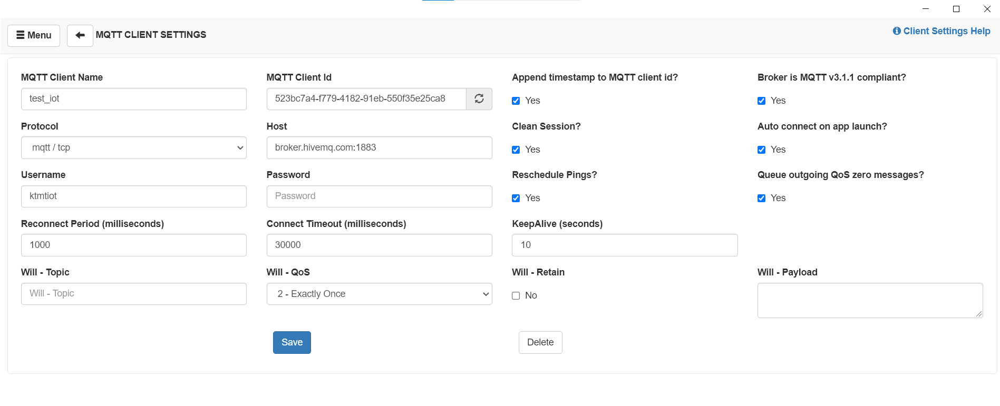
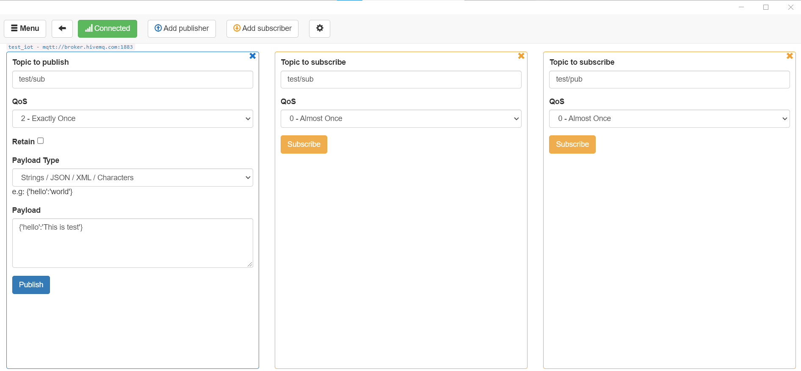

# IoT-Asignment
## MQTT demo

### Tạo client
#### Cài đặt MQTTBox và tạo client
Cài đặt tiện ích mở rộng MQTTBox trên GoogleChrome\
Tạo mới client trên MQTTBox\
\
Đăng ký publish và subcribe trên MQTTBox\

#### Cài đặt chương trình java và tạo client
Cài đặt java, Eclipse và project java 'iot_lab_01'

### Demo trao đổi dữ liệu giữa các client
#### Bước 1
Chọn subcribe các topic 'test/sub' và 'test/pub' ở MQTTBox client

#### Bước 2
Chạy chương trình Java và quan sát bản tin được gửi đi đã được nhận ở MQTTBox client

#### Bước 3
Publish bản tin với topic 'test/sub' ở MQTTBox client và quan sát ở client Java bản tin nhận được
